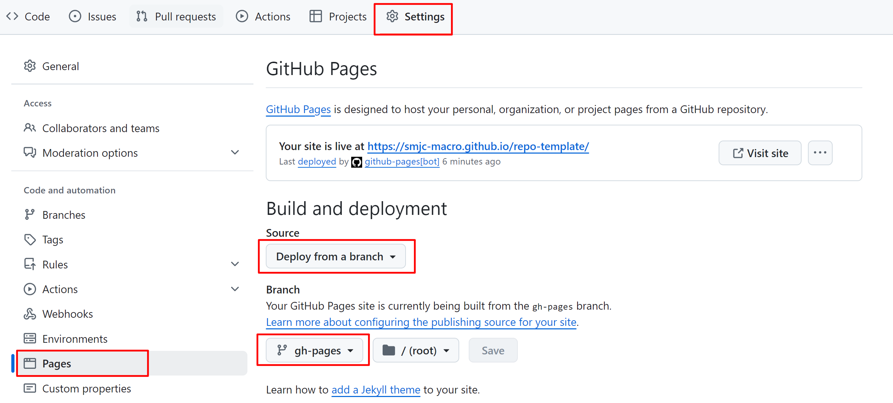

# 构建参考

[repo-template](https://github.com/smjc-macro/repo-template) 是一个 MKDocs-Materials 模板，用于快速搭建宏程序帮助文档的 Github Pages，按照以下步骤即可构建站点。

## 安装 Python

安装 [Python](https://www.python.org/downloads) 解释器，建议使用 3.12 及以上版本。

## 配置虚拟环境

打开 VS Code，安装 Python 扩展，按下快捷键 ++ctrl+shift+p++，输入 `Python: Create Environment`，根据提示建立一个 .venv 虚拟环境，注意勾选安装 `requirements.txt` 中的依赖项。

## 撰写项目文档

需使用 markdown 格式撰写项目文档。建议所有项目文档都存放在 `docs` 目录下。

## 修改构建文件

修改 `mkdocs.yml` 文件，修改站点信息、导航信息等。

各配置项的具体含义请参考：

- [mkdocs 文档](https://www.mkdocs.org/user-guide/configuration/)
- [mkdocs-material 文档](https://squidfunk.github.io/mkdocs-material/setup/changing-the-homepage/)

## 本地预览

运行 `mkdocs serve` 命令，即可在浏览器中预览项目文档。默认地址为：[127.0.0.1:8000/repo-template](http://127.0.0.1:8000/repo-template/)

## 远程部署

将本地仓库推送到远程仓库，即可在 GitHub Pages 上部署项目文档。

<!-- prettier-ignore-start -->
!!! note
    您需要前往仓库的 Settings -> Pages -> Build and deployment -> Source 中选择 **Deploy from a branch**，并在下方的 Branch 中选择 **gh-pages** 开启仓库的 Github Pages 功能。

    

<!-- prettier-ignore-end -->

## 添加 Website 到仓库主页的信息中

前往仓库主页，点击右侧边栏的齿轮，勾选 `Use your Github Pages website` 即可。

<!-- prettier-ignore-start -->
!!! info
    您可以前往项目仓库的 Action 页面查看站点的构建过程。

<!-- prettier-ignore-end -->
